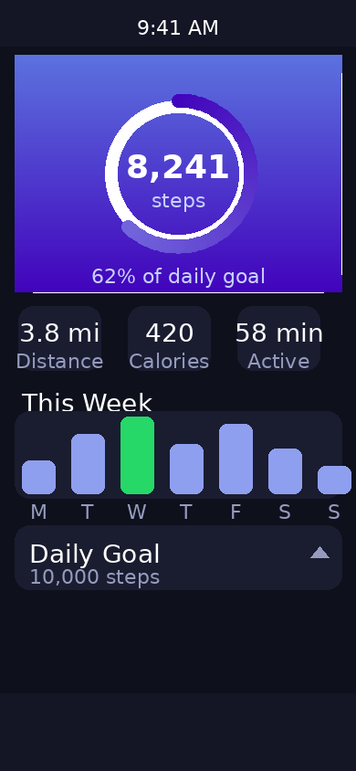
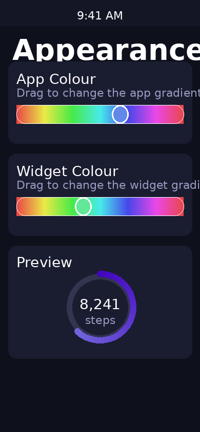
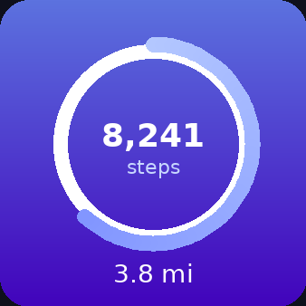
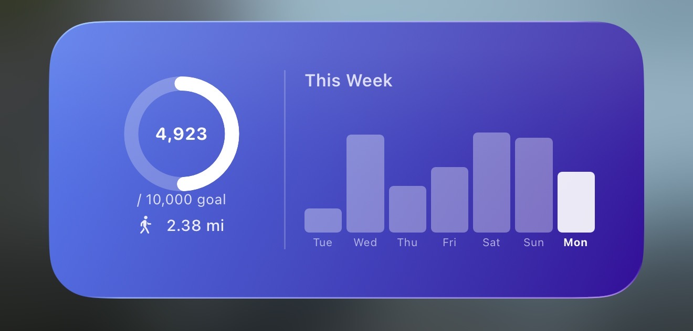

# StepTracker 👟

A clean, native iOS step counter powered by Apple HealthKit — with home screen and lock screen widgets.

---

## Screenshots

### App
<p float="left">
  
  
  
</p>

### Widgets
<p float="left">
  
  
</p>

> **To add screenshots:** create a `screenshots/` folder in the repo root, take screenshots on your iPhone, and drop them in.

---

## Features

- **Live step count** — reads directly from Apple Health, updates in the background
- **Animated goal ring** — circular progress ring showing steps inside, goal progress around the edge
- **Distance walked** — automatic conversion to miles
- **7-day weekly bar chart** — colour-coded history (green = goal met)
- **Configurable daily goal** — presets at 5K, 7.5K, 10K, 12.5K, 15K plus custom input
- **Home screen widgets** — Small (ring + distance) and Medium (ring + weekly chart)
- **Lock screen widgets** — Circular gauge and Rectangular bar (iOS 16+)
- **Background refresh** — HealthKit observer queries keep data current without opening the app

---

## Requirements

- iOS 16.0+
- Xcode 15+
- Apple Developer account (free for personal device testing, $99/yr for App Store)

---

## Getting Started

### 1. Clone the repo
```bash
git clone https://github.com/yourusername/StepTracker.git
cd StepTracker
```

### 2. Open in Xcode
```bash
open StepTracker.xcodeproj
```

### 3. Configure signing
- Select the **StepTracker** target → **Signing & Capabilities** → set your **Team**
- Repeat for the **StepWidget** target

### 4. Register the App Group
In Signing & Capabilities on both targets, click the **refresh button** next to `group.com.abhinav.steptracker` to register it with your Apple account.

### 5. Run on device
Select your iPhone as the build destination and press **⌘R**. On first launch, tap **Allow All** for HealthKit access.

### 6. Add the widget
Long press your home screen → **+** → search **StepTracker** → choose Small or Medium.

---

## Architecture

```
StepTracker/
├── Shared/
│   └── Models.swift              # StepData, DaySteps, App Group UserDefaults
├── StepTracker/                  # Main app target
│   ├── StepTrackerApp.swift
│   ├── ContentView.swift         # Main screen — ring, stats, chart, goal editor
│   ├── HealthKitManager.swift    # HealthKit queries (steps, distance, weekly history)
│   ├── GoalRingView.swift        # Animated circular progress ring
│   └── WeeklyBarChartView.swift  # 7-day bar chart
└── StepWidget/                   # Widget extension target
    ├── StepWidgetBundle.swift
    ├── StepWidgetProvider.swift  # WidgetKit timeline provider (refreshes every 15 min)
    └── StepWidget.swift          # Widget views — small, medium, lock screen
```

### Data flow

```
Apple Health ──► HealthKitManager ──► App Group UserDefaults ──► WidgetKit Timeline
```

The main app queries HealthKit and writes `StepData` to a shared App Group `UserDefaults`. The widget reads from the same store — no direct HealthKit access needed. HealthKit observer queries trigger background refreshes whenever new steps are recorded.

---

## Customisation

| File | What to change |
|------|----------------|
| `Models.swift` | App Group identifier |
| `HealthKitManager.swift` | Add calories, floors climbed, heart rate |
| `GoalRingView.swift` | Ring colours, thickness, animation style |
| `StepWidget.swift` | Widget colours, layout, add `.systemLarge` |
| `ContentView.swift` | Main app UI, additional stat cards |

---

## License

MIT — free to use, modify, and distribute.
